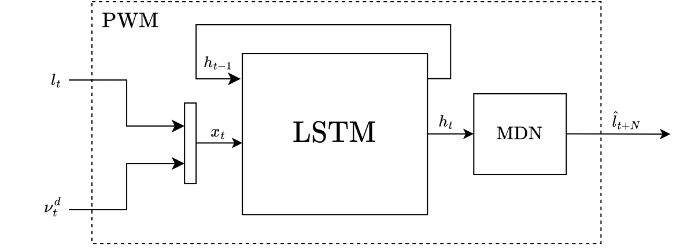
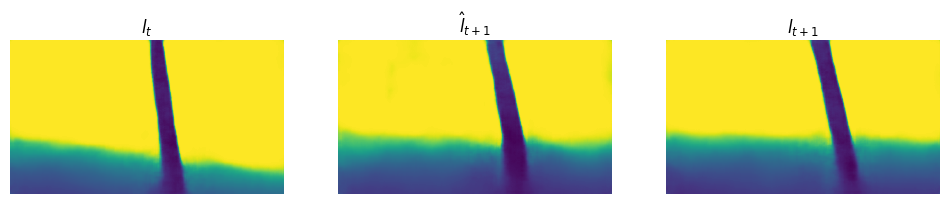

# MDN-RNN Based Predictive World Model (PWM)

Developed during my semester project, the PWM was trained to predict the latent dynamics of trajectories from a quadrotor in dynamic environments. The code utilizes the seVAE from https://github.com/ntnu-arl/sevae. 

### MDN-RNN

### Prediction Performance

